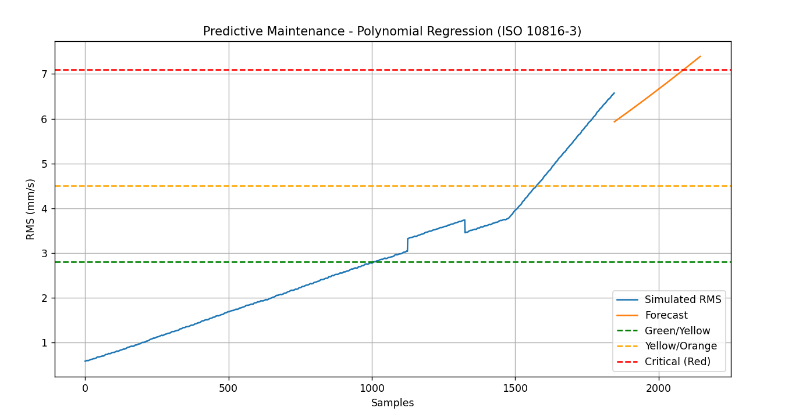
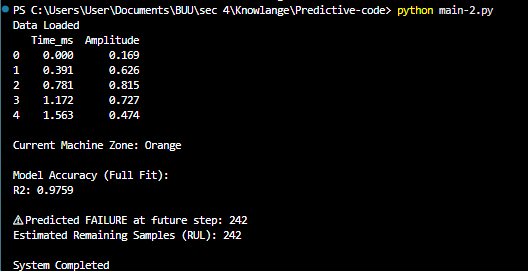

***ผลลัพธ์หลังจากการทำงาน

1) การอธิบายกราฟ
กราฟแสดงแนวโน้มค่า RMS (mm/s) ของการสั่นสะเทือนเครื่องจักรเทียบกับจำนวนตัวอย่าง (Samples) โดยประกอบด้วย 3 ส่วนหลัก ได้แก่
1.	เส้นสีน้ำเงิน (Simulated RMS)
เป็นค่า RMS หลังจากคำนวณจาก Amplitude ด้วย Rolling Window และทำการจำลองแนวโน้มการเสื่อมสภาพ (Degradation)
จะเห็นว่าแนวโน้มเพิ่มขึ้นอย่างต่อเนื่อง และมีการเร่งตัวในช่วงท้าย ซึ่งสะท้อนลักษณะการเสื่อมของเครื่องจักรหมุนจริง
2.	เส้นสีส้ม (Forecast)
เป็นค่าที่ได้จากการพยากรณ์ล่วงหน้าด้วยแบบจำลอง Polynomial Regression
เส้นมีลักษณะโค้งเพิ่มขึ้น สอดคล้องกับแนวโน้มการเสื่อมแบบเร่งตัว
3.	เส้นประแนวนอน (ISO 10816-3 Zones)
ใช้แบ่งระดับความรุนแรงของการสั่นสะเทือนตามมาตรฐาน ISO 10816-3 ได้แก่
o	2.8 mm/s → Green/Yellow
o	4.5 mm/s → Yellow/Orange
o	7.1 mm/s → Red (Critical)
จากกราฟพบว่าแนวโน้มกำลังเข้าสู่โซนวิกฤติ (Red Zone)

2) ผลลัพธ์จากโปรแกรม
จากผลการรันโปรแกรม

•	Current Machine Zone: Orange

•	Model Accuracy (R²): 0.9759

•	Predicted Failure at future step: 242

•	Estimated Remaining Useful Life (RUL): 242 samples

การตีความผลลัพธ์
1.	ค่า R² = 0.9759
แสดงว่าโมเดลสามารถอธิบายแนวโน้มข้อมูลได้ประมาณ 97.59% ถือว่ามีความแม่นยำสูง
2.	เครื่องจักรปัจจุบันอยู่ใน Orange Zone
หมายถึงเครื่องอยู่ในระดับเตือน (Unsatisfactory) ควรวางแผนบำรุงรักษา
3.	คาดว่าจะเข้าสู่ Red Zone (7.1 mm/s) ภายใน 242 ตัวอย่างถัดไป
ซึ่งสามารถตีความเป็น Remaining Useful Life (RUL)
